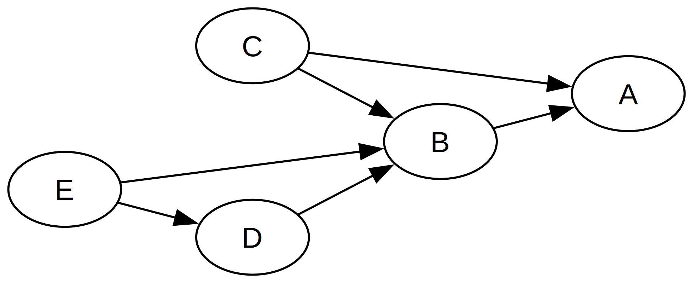

# spring-context-scanner

Scan [spring beans context](https://docs.spring.io/spring-framework/reference/core.html) and generate graph
using [graphiz](https://graphviz.org/) thanks its [java API](https://github.com/nidi3/graphviz-java).

## Prerequisites
Install [graphiz](https://graphviz.org/download/) and add it to system path.

## Usage
A simple example can be found [here](./src/test/java/org/yah/tools/spring/context/scanner/SpringContextScannerTest.java).    
That will generate this output SVG :   
